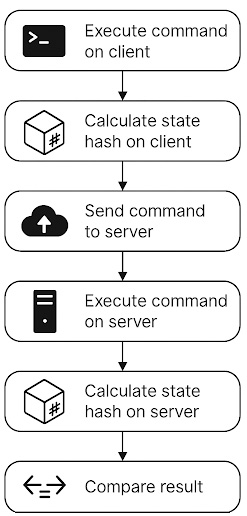
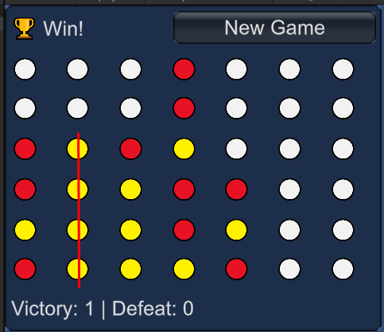
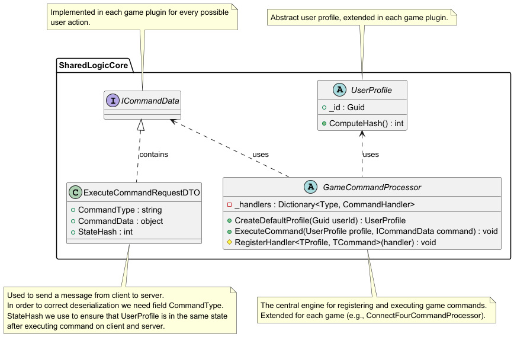
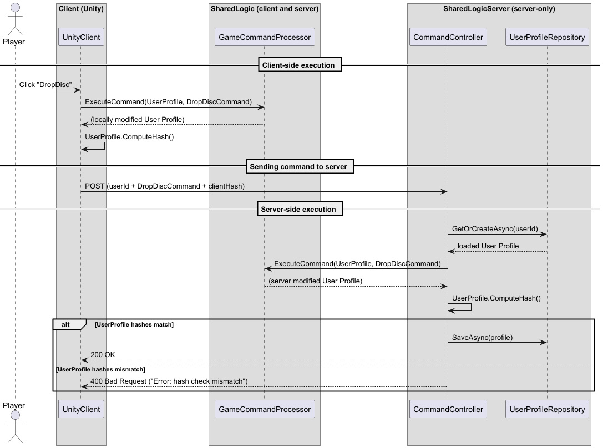

# Hybrid Client-Server Architecture for Mobile Games: Shared Logic Approach
In the mobile game industry, it’s common for several backend developers to be assigned to a single project. For example, studios developing a PvP shooter with a meta-game often employ 5–8 server specialists—and this is considered standard practice.

However, in our company (around 40 employees, 3 projects in simultaneous development), a single backend developer successfully manages this task.

Our games are difficult to hack: every player action is always verified by the server, which practically eliminates 
cheating. We’ve been using this approach for many years, having tested it on dozens of projects, and I don’t know of a
single case of someone who started working this way ever going back to more classic architectures.

This article is about how to implement a hybrid client-server interaction architecture that allows you to achieve a high level of security with minimal resources. This solution benefits everyone:  
- Developers find it easier to write and test code
- The business saves on backend development costs
- Players can trust the fairness of matches and the absence of cheaters
>💡 Everyone benefits when **game developers** focus on **gameplay** rather than writing **backend code**!

When designing a mobile game architecture, it’s important to understand that there are two types of client-server interaction, each requiring different approaches and solutions:  
- Real-time interaction (for example, combat in a 3D shooter)
- Turn-based mode with persistent state (often the meta-game—a player’s profile, their items, game currencies, and so on)  

Let’s look at how each of these is structured.

## Real-time interaction
There are many solutions for real-time interaction. Among the most popular for Unity projects are:  
- Fusion from www.photonengine.com, previously also PUN and Bolt by the same company
- Netcode for Game Objects from Unity Technologies https://docs-multiplayer.unity3d.com/
- Mirror, based on UNet, Unity Tech’s previous networking solution https://github.com/MirrorNetworking/Mirror

This is just a small sample of the available options. Approaches range from full client trust and peer-to-peer, to classic authoritative servers with client-side prediction, lag compensation, and other mechanisms.

We won’t focus on real-time interaction here, as this is a well-explored field with many ready-made solutions; usually, you just need to pick what best fits your game’s and team’s requirements.

## Turn-based mode with persistent state
It’s a rather clumsy term, but this model is found in the vast majority of modern games. For example, at the beginning of the game, you’re often prompted to create your own character. Frequently, your character will gradually acquire additional customization items or weapons. This also includes various in-game currencies, loot boxes, and other mechanics commonly used in **Free-to-Play** games.

There are four widespread approaches here:

- Authoritative server + thin client
- Minimal state server + thick client
- Hybrid approach
- PlayFab, UnityGameServices

Let’s briefly review them.

### Authoritative server + thin client
>💡 **Authoritative server**:  
All game logic and action validation are performed on the server. The client is just the interface and “control panel.”
This provides maximum protection against cheating, but results in poor responsiveness and possible lag for the player.

This setup means that all player action processing logic and the player’s state are stored on the server. The client is used to display the state and send commands to the server.

It’s a great solution, but it comes with technical and often organizational challenges:

- Technically, this approach assumes the user has a great internet connection, which is often not the case for mobile games.
- Even with a decent connection, system response times can be noticeable: you press the button to buy an item, and it doesn’t appear instantly—it only shows up after server processing. Alternatively, you can show it right away, but this complicates client logic.
- Dividing logic between client and server means even small tasks often require two developers—one on the client, one on the server. Interaction between developers often becomes a bottleneck.
- The server is written for a specific game, and little of it can be reused in future projects.
- Servers are often written in a different technology stack (for various reasons: backend developers’ skills, legacy from previous projects, or personal preferences). A different tech stack adds challenges at the client-server junction, and small technological differences can pop up in unexpected places.

Despite these drawbacks, this is still a good approach for PC and console games, as proven by thousands of successful projects.

### Minimal state server + thick client
> 💡 **Thick client**:  
All game logic lives on the client; the server simply saves the data it receives.
This is very simple and inexpensive, but any data can easily be tampered with—protection is minimal.

Here, almost all the logic is on the client, while the server just saves the player’s state received from the client. The server trusts whatever the client sends.

If the game doesn’t have in-app purchases or online interactions between players, this is a workable approach.

- The big advantage here is a simple server, which can also be reused with minimal modifications in different games.
- The downside is that it’s easy to manipulate player data (i.e., cheat), since the server doesn’t check it and just saves whatever it receives.

### Hybrid approach
> 💡 **Hybrid**:  
Fast feedback is achieved by running logic on both client and server.
Critical checks are duplicated, reducing the risk of cheating but making development and debugging more complex. This is the most expensive and most common option.

Often, the delays inevitable in a thin client are unacceptable. For example, when rearranging buildings on your base, you need to check whether a building overlaps with others, exceeds the player’s area, or is in a state that allows it to be moved. In such cases, all these checks often have to be performed on the client for “responsiveness”—and then repeated on the server. The server may use a different data organization, may be written in a different programming language, and may be handled by a different developer.

Key features:

- Good responsiveness: the player typically sees the result of their actions immediately.
- Logic is partially duplicated between client and server; the server can’t be reused for a different game.
- Debugging problems can arise from duplicated logic—because of small differences, something may be considered valid on the client but not on the server.
- Rolling back actions that are invalid from the server’s point of view is challenging—resetting the game is easier for developers but worse for players; rolling back only the problematic action is better for users but harder for devs.

Despite being the most labor-intensive, the hybrid approach is actually the most common, sometimes leaning closer to a thin client or closer to a minimal server with a thick client. In the thick client case, the server usually still tries to add checks for the most blatant hacks. In the thin client case, most of the logic is duplicated on the client to reduce interface delays.

I would also consider solutions like PlayFab or UnityGameServices Economy to be hybrid approaches.

## Shared Code Between Client and Server

> 💡 **Shared Logic:**  
The same code for processing game commands runs both on the client and the server.  
This provides instant feedback for the player and simultaneously protects against cheating: the server re-executes the command and compares the resulting state with the client's.

There is an approach that combines development convenience with a high level of security—**the Shared Logic architecture**. Here, both the client and server use a common set of commands and processing logic, conceptually similar to the **Command design pattern** but adapted for use across both client and server.  

Whenever the player performs an action, the corresponding command is executed on both sides and changes the player's profile state in exactly the same way. At the end, the server compares the hash of the profile state: if it matches the client’s, everything is correct. If not, it indicates tampering with the data or logic, and such a case is considered an attempt to cheat.



Before diving into the details, let’s see how this looks in the context of a specific game.

### Applying the Concept: The Example of Connect Four

For each game, we write our own code implementing its rules and logic.

At a minimum, we need to:
- Describe the **user profile** by defining the fields required for your game.
- Create **commands** that describe possible player actions.
- Write **handlers** for these commands, which describe what changes should happen to the user profile as a result.

As an illustration, here’s the implementation of the well-known Connect Four game. Players take turns choosing which column to drop a disc into, and the first to align 4 discs in a row wins.



To keep it simple, let’s assume that we play only against the computer—after the player’s move, the computer immediately makes its move.

Thus, we only need two commands:
- Drop a disc into column X
- Start a new game

#### Sending Commands

In the simplest case, in a Unity client, calling these commands can look like this:

```csharp
if (_profile.Result == GameResult.InProgress)
{
    // Show 7 drop buttons, one for each column
    for (int col = 0; col < 7; col++)
    {
        if (GUILayout.Button("↓", GUILayout.Width(30)))
        {
            // If the '↓' button is pressed, execute the command, check the hash, send it to the server, and verify it there
            ExecuteCommand(new DropDiscCommand { Column = col });
        }
    }
}
else
{
    if (GUILayout.Button("New Game"))
    {
        // If the "New Game" button is pressed, start a new game
        ExecuteCommand(new NewGameCommand());
    }
}
```

The call to `ExecuteCommand(...)` is straightforward, even though it means a whole sequence of actions, including local execution and server-side verification.

#### Displaying State

Suppose the user profile (or game state) is stored in a variable called `_profile` and defined like this:

```csharp
public enum CellState { Empty, Player, Computer }

public class ConnectFourProfile : UserProfile
{
    // In Connect Four, the board is usually 6x7.
    // The profile stores the entire game board state.
    public CellState[,] Board = new CellState[6, 7];
    // ...
}
```

Then the board can be displayed in the client like this:

```csharp
// Display game board
for (int row = 0; row < 6; row++)
{
    GUILayout.BeginHorizontal();
    for (int col = 0; col < 7; col++)
    {
        var cell = _profile.Board[row, col];
        string label = cell switch
        {
            CellState.Player => "🟡",
            CellState.Computer => "🔴",
            _ => "⚪"
        };
        GUILayout.Label(label, GUILayout.Width(30));
    }
    GUILayout.EndHorizontal();
}
```

Here, Unity's `OnGUI` method is used for interface visualization, which is generally not used in real projects, but is great for demonstration purposes due to its simplicity.

#### Implementing Command Processing

A command means modifying the player's profile. In the simplest case, it can be just a line or two, for example, if we want to reset the state as with the `NewGameCommand`.

In general, we just specify which type of command calls which code; in this code, we can modify the player's profile, and it will change both on the client, the server, and in the database.

Some commands, like `DropDiscCommand`, are more verbose, but it's just ordinary C# code—nothing special.

```csharp
public ConnectFourCommandProcessor()
{
    // The new game command clears the board and resets the game status.
    // Victory and defeat stats remain unchanged.
    RegisterHandler<ConnectFourProfile, NewGameCommand>((userProfile, cmd) =>
    {
        userProfile.Board = new CellState[6, 7];
        userProfile.Result = GameResult.InProgress;
    });

    // This is the main command handler - dropping a disc.
    // The game is always against the computer in this example.
    RegisterHandler<ConnectFourProfile, DropDiscCommand>((userProfile, cmd) =>
    {
        if (userProfile.Result != GameResult.InProgress) return; // Ignore command if game is finished

        // Player's move
        var row = DropDisc(userProfile.Board, cmd.Column, CellState.Player);
        if (row == -1)
            throw new Exception("Column full");

        // Did the player win?
        if (CheckVictory(userProfile.Board, row, cmd.Column, CellState.Player))
        {
            userProfile.Result = GameResult.Win;
            userProfile.VictoryCount++;
            OnVictory?.Invoke();
            return;
        }

        // Computer's move (rule-based AI)
        var rand = new DeterministicRandom(userProfile.Seed++); // Deterministic random generator
        int baseCol = rand.Next(0, 7); // Starting point for fallback column choice
        int aiCol = ChooseBestMove(userProfile.Board, baseCol);
        int aiRow = DropDisc(userProfile.Board, aiCol, CellState.Computer);

        // Did the computer win?
        if (CheckVictory(userProfile.Board, aiRow, aiCol, CellState.Computer))
        {
            userProfile.Result = GameResult.Defeat;
            userProfile.DefeatCount++;
            OnDefeat?.Invoke();
        }

        // Check for draw
        if (userProfile.Result == GameResult.InProgress && IsBoardFull(userProfile.Board))
        {
            userProfile.Result = GameResult.Draw;
            OnDraw?.Invoke();
        }
    });
}
```

A notable point here is the use of the `DeterministicRandom` helper class, because we need the random number generator to produce the same result on the same user profile with the same command. This cannot be guaranteed with `System.Random`, even with a synchronized seed, since it may produce different results on different platforms.

In fact, the code above would look almost the same even if we didn’t use the Shared Logic approach.
There's nothing revolutionary here; it doesn’t require you to think about multithreading, reactive programming, ECS, asynchronous execution, etc.
Even a developer with little experience can write this code—one, instead of two developers (one for the frontend and one for the backend).


### Main Modules and Their Roles

Let's now move from examining a practical example to discussing the implementation details of the Shared Logic system as a whole.

Some readers may find it more convenient to explore the source code directly before diving into the detailed explanation below.  
[🔗 View the full source code on GitHub](https://github.com/NikolayLezhnev/sharedlogic/tree/article)

Our system consists of several separate modules, each a standalone project within a .NET solution and performing a well-defined role:

- **Shared Logic Core** — contains basic interfaces, user profile structure, and common command logic. This code is reused on both client and server.
- **Shared Logic Server** — a .NET 8 web service that processes commands sent from the client: it re-executes them on the server, computes the hash, and compares it to the client’s value for verification.
- **Specific Game Plugin** — implements game-specific commands and their handlers, and also contains user profile descriptions for a specific game. This code is also reused on both client and server.
- **Unity Client** — an example Unity client that executes commands locally, instantly updates the profile state, and sends requests to the server for confirmation.

`Shared Logic Core` is connected to `Shared Logic Server` as a project dependency; in the Unity client, it’s connected via Unity's Package Manager.  
`Specific Game Plugin` is loaded by the backend service at startup, allowing you to use the same backend for different games without rebuilding. In the Unity client, `Specific Game Plugin` is also connected via Unity's Package Manager.  
The example `Specific Game Plugin` contains code for the well-known game Connect Four.

#### Implementation Details

##### Shared Logic Core

The system's core is here. The idea is that you don't need to change it for each game—it’s simply reusable code from project to project.  
For demonstration, all the code for this module is in a single file, `SharedLogic.cs`. Since there isn't much code, it's easier to navigate.



**Main classes:**

- **UserProfile**  
  A serializable representation of the player's state, e.g., inventory, progress, currencies, etc.  
  It's usually inherited to add fields necessary for a particular game.  
  `ComputeHash` is used to calculate the state hash for comparing the results of executing a command on the client and server.

- **GameCommandProcessor**  
  Associates command types with handler delegates.  
  Handler delegates accept the player's profile and a command. During execution, they usually modify the player's profile.  
  You can register a handler delegate via `RegisterHandler`.  
  `ExecuteCommand` takes a mutable user profile and the command to apply to it. This method is called both on the client and the server.  
  Importantly, `GameCommandProcessor` should be stateless—all state should be inside `UserProfile`. On the server, there is only one instance of `GameCommandProcessor` handling requests for all clients.

- **ICommandData**  
  Marker interface for all command data classes.

##### Shared Logic Server

This turns out to be one of the simplest parts of the system.
It’s convenient to start with `Program.cs`: it loads `SpecificGamePlugin.dll` and instantiates the main game logic class, which must inherit from `GameCommandProcessor`.

Besides that, the usual WebAPI service setup is performed: serializer configuration and **MongoDB** driver initialization.

**Newtonsoft.JSON** is used for serialization—not the fastest, but illustrative and compatible with **AOT** (important for Unity builds).

**MongoDB** is used as the database. It’s a convenient choice that requires virtually no setup after installation, and with **MongoDB Compass** you can conveniently inspect records in a readable form.

**Key class:**  
**CommandController**
```csharp
[ApiController]
[Route("api/[controller]")]
public class CommandController : ControllerBase
{
    public async Task<IActionResult> LoadProfile(Guid userId);
    public async Task<IActionResult> Execute([FromHeader(Name = "X-User-Id")] Guid userId, [FromBody] ExecuteCommandRequestDTO request);
}
```

When called from the client, `LoadProfile` simply retrieves the user’s profile from the database using `UserProfileRepository` and returns it (needed once at game startup).

When executing a command (`Execute`), the controller retrieves the user profile, looks up and deserializes the command using the command type name, and executes it via `GameCommandProcessor`. The `CommandController` then compares the updated profile hash to the client’s value for verification. If everything matches, it saves the updated profile and returns success; otherwise, it returns an error.

##### Specific Game Plugin

For each game, we write our own code implementing its rules and logic.

For simplicity, it’s all in one file here—`SpecificGamePlugin.cs`—but in real projects, this is usually a set of files and classes. This code is connected to the Unity client (as source code via `manifest.json` / `package.json`) and to the server as `SpecificGamePlugin.dll` placed in  `SharedLogicServer/Plugins/SpecificGamePlugin.dll`.

**ConnectFourProfile:**

```csharp
public class ConnectFourProfile : UserProfile
{
    public CellState[,] Board = new CellState[6, 7];
    public GameResult Result = GameResult.InProgress;
    public int Seed; 
    public int VictoryCount = 0;
    public int DefeatCount = 0;
}
```
Adds fields specific to the Connect Four game to the base user profile. `Board` has a size of 6 rows and 7 columns.  
`Seed` is necessary to ensure that when commands are executed, you get the same result on both the client and server, so the random number generator must use the same seed.

**DropDiscCommand:**

```csharp
public class DropDiscCommand : ICommandData
{
    public int Column { get; set; }
}
```
The main command in the game: each turn, the player chooses which column to drop their disc into.

**NewGameCommand:**

```csharp
public class NewGameCommand : ICommandData { } 
```
The command to start a new game. Sometimes commands don’t even contain any parameters.

**ConnectFourCommandProcessor:**

```csharp
public class ConnectFourCommandProcessor : GameCommandProcessor
{
   public ConnectFourCommandProcessor()
   {
       // The new game command clears the board and resets the game status.
       // Victory and defeat stats remain unchanged.
       RegisterHandler<ConnectFourProfile, NewGameCommand>((userProfile, cmd) =>
       {
          // new game command implementation
       });

       RegisterHandler<ConnectFourProfile, DropDiscCommand>((userProfile, cmd) =>
       {
          // drop disc command implementation
       });
   }

   public override UserProfile CreateDefaultProfile(Guid userId);
   // additional helper methods
}
```

This class ties everything together, registering the handlers for `DropDiscCommand` and `NewGameCommand`. It also describes how to create a new user profile (`CreateDefaultProfile`). When handling commands, it uses helper methods related to the specific game’s logic, located in the same class.

**DeterministicRandom:**  
A simple deterministic random number generator.
As noted above, it ensures that the same sequence of random numbers is produced on both client and server for the same user profile and command.

### Sequence Diagram for Command Execution

Below is an example of the sequence for the `DropDisc` command:



### Pitfalls, Limitations, and Debugging Features

Of course, there are limitations to this approach.  
You need the states to match bit-for-bit—otherwise, the hashes won’t match.

#### What can cause problems?

- **Arithmetic computations:**  
  Using floats often leads to different results on different platforms. Therefore, use decimals or integer arithmetic.


- **Serialization:**  
  Using types with non-guaranteed order, such as `Dictionary<TKey, TValue>` or `HashSet<T>`, may result in different orders during serialization, leading to different hashes, since we compare the serialized data for simplicity.  
  There is no such problem with `List` or a regular array. You can also use `SortedDictionary`.  
  You can override the implementation of `UserProfile.ComputeHash()` so it doesn’t rely on serialization, but this requires extra effort and code.  
  Serialization problems will depend on the specific solution used; you don’t have to use JSON for this. However, if hash calculation is based on the serialized byte array, keep these quirks in mind.


- **Adding state outside of UserProfile:**  
  All player state must be stored entirely in the fields of your class that inherits from `UserProfile`.  
  If you add a field, for example, to `GameCommandProcessor` itself to store something related to the player’s state, the server will have no knowledge of it.
  Moreover, there is only one instance of `GameCommandProcessor` on the server, by design—this class is meant to be stateless.  
  Similarly, you may run into issues if you introduce a static variable and access it in your command handling code. On the server, such a variable will not necessarily have the same value as on the client.  
  However, you are free to use local variables within your methods; their lifetime is limited to the scope of the command execution.  
  You quickly get used to this limitation, but the compiler won’t save you—errors will only appear at runtime and may not be obvious.


- **No familiar Unity API:**  
  There is no dependency on `UnityEngine.dll` in the `SpecificGamePlugin` code, because the code must run not only in Unity but also on the server.  
  Sometimes you’d like to have some types from UnityEngine available in `SpecificGamePlugin`, but usually you have to create equivalents. For example, `UnityEngine.Random`, `UnityEngine.Mathf`, or `UnityEngine.Vector3`.  
  But if we’re talking about actual game rules, which should be defined in `SpecificGamePlugin`, there are very few such classes, and replacing them is not a big deal.


- **Debugging:**  
  This approach is very convenient for debugging.  
  Usually, debugging a game together with the backend is not easy: you need to install lots of dependencies, build the server, build the game, run both, attach the debugger to both, set up network timeouts, etc.  
  Here, for debugging purposes, you can simply disable sending commands to the server.  
  Yes, your state won’t be saved on the server, but you can debug all the commands using a regular debugger because they will all be executed locally.

> 💡 **Debugging without a server:**  
You can implement a debug mode just for the game in the editor, which does not require sending data to the server and instead saves `UserProfile` to disk and loads it from there at startup.

Using tools like **MongoDB Compass** allows you to view user profiles in a very convenient way and even edit them.

### Performance Testing

All this is great, but how fast is it?

The main load usually comes from serialization:
- You need to serialize the command itself to send it to the server.
- Then you need to serialize the `UserProfile` to compute its hash.
- Then you need to deserialize the command on the server.
- Then you need to deserialize from BSON the `UserProfile` returned by MongoDB.
- Then you need to serialize the `UserProfile` back to BSON to put it into MongoDB.
- Then you need to serialize the `UserProfile` again to compute its hash on the server.

We can eliminate steps 2 and 6 by overriding hash calculation methods.  
We can almost eliminate steps 4 and 5 by caching the `UserProfile` in memory, so we don’t need to access the database each time; in memory, it can be stored in deserialized form.  
> 💡 **Database Caching:**  
Caching requests not only reduces the database load but also greatly reduces the number of heavy serialization-deserialization operations.

Additionally, instead of JSON, you can use binary serialization formats such as MessagePack.
This can speed up serialization by 5–10 times, but it comes at the cost of convenience: debugging and inspecting data becomes less straightforward.

But let’s just see how it works as simply as possible.  
For this, I wrote a benchmark that creates a user, executes 10 "drop disc" commands in different columns, then executes a “start new game” command and does another 10 moves. You can see the source code in `Benchmark/Program.cs`.

Here are the results on an AMD Ryzen 9 5900X (12 cores):

```
E:\Projects\SharedLogic.github\sharedlogic\Benchmark\bin\Release\net8.0>Benchmark.exe
Benchmark completed.
Total requests: 70400
Elapsed time: 3.97 seconds
Requests per second: 17712.19
```

For comparison, here are the results on a 7-year-old notebook with Core-i5-8300H (4 cores):

```
C:\Projects\SharedLogic\Benchmark\bin\Release\net8.0>Benchmark.exe
Benchmark completed.
Total requests: 70400
Elapsed time: 21.19 seconds
Requests per second: 3322.58
```

You can see that performance scales perfectly with increased processing power.

Is 17,000 requests per second a lot or a little?  
If we use this system as intended, the user’s request frequency is usually not that high. These are inventory operations, equipment changes, lootbox openings and similar actions — in reality, on average about 1 request per 10 seconds per user.  
So, even the simplest implementation with a small profile and on an ordinary desktop computer could handle 80,000–170,000 concurrent users, which is definitely enough for most projects.

Just for fun, I tried adding simple in-memory profile caching to reduce database requests. Here are the results on an AMD Ryzen 9:

```
E:\Projects\SharedLogic.github\sharedlogic\Benchmark\bin\Release\net8.0>Benchmark.exe
Benchmark completed.
Total requests: 70400
Elapsed time: 0.96 seconds
Requests per second: 73262.07
```

This already means hundreds of thousands of CCU — a great result in my opinion!

> 💡 **Reverse Proxy:**  
For production .NET servers, it's best to run them behind a reverse proxy — for example, Nginx.  
This improves security, enables HTTPS, improves performance, limits the number of connections, and makes the app more robust.  
.NET 8 (Kestrel) is not intended for direct exposure to the Internet.

### Conclusions

Our team's experience shows: implementing a hybrid Shared Logic architecture for mobile games offers real advantages — both in security and development speed.  
A single backend developer can maintain several game projects at once without a loss in quality, something that seemed impossible before.

> 💡 **Production-Proven:**  
In our company, more than a dozen projects have been successfully released using this architecture — and it has proven its effectiveness in practice.

This approach frees the team from routine, saves the business resources, and gives players instant feedback and cheat protection.  
The server confirms every player action by checking the state, and any attempt to bypass the system is easily detected.

**Key takeaways:**
- Instead of a large backend team, you only need one experienced engineer, freeing up resources to develop new features and the game itself.
- Logic for each game is easy to scale and extend — everything is encapsulated in a separate plugin.
- Players get fair matches and a predictable gameplay experience.
- Debugging and testing are easier: all commands can be executed and verified locally.
- Performance is proven by tests — even on standard hardware, the system handles thousands of requests per second, and with caching — tens of thousands.
- Shared Logic is not just another pattern, but a proven tool, especially for mobile and midcore projects with extensive meta-games.

If you’d like to adopt this approach, I’ll be happy to share my experience, discuss details, or consult with your team.  
Feel free to reach out — I’m always open to collaboration!

[🔗 Full source code and implementation on GitHub](https://github.com/NikolayLezhnev/sharedlogic/tree/article)

**Contact:**  
[LinkedIn: nlezhnev](https://www.linkedin.com/in/nlezhnev/)  
Telegram: [@nikolaylezhnev](https://t.me/nikolaylezhnev)
